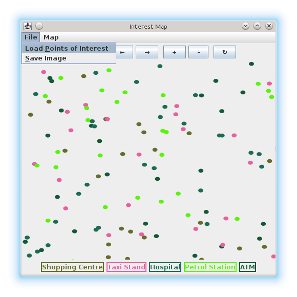
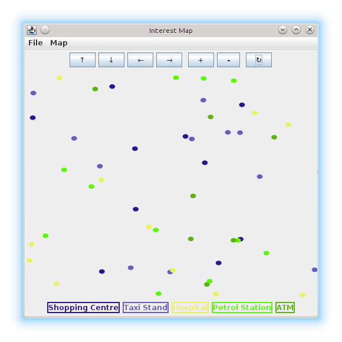

# Pre-requisites #

Requires [au.com.bytecode.opencsv.CSVReader](http://opencsv.sourceforge.net).  
On Debian, install libopencsv-java and include /usr/share/java/opencsv.jar when compiling.

# How to run #

Extract

```bash
unzip 11429074_ass1.zip
cd task1
```

Compile and run using ant

```bash
ant
```

Compile and run without ant

```bash
mkdir bin
javac -d bin -classpath bin:/usr/share/java/opencsv.jar \
  -sourcepath src src/interestmap/InterestMap.java
java -classpath /usr/share/java/opencsv.jar:bin interestmap.InterestMap
```

# Expected output #

After running:  


Use the plus and minus **+ -** buttons to zoom in and out:  


Use the arrow **↑ ↓ → ←** buttons to pan around:  


Use the circle arrow **$\circlearrowright$ ↻** button to reset the zoom and pan back to normal.

Open a new file with the *File → Load Points of Interest* menu:  




Colours are generated randomly. Re-generate colours with the *Map → Change Colours*:  


Save the current view as an image with the *File → Save Image* menu:  
For some reason this comes out with a black background!  

